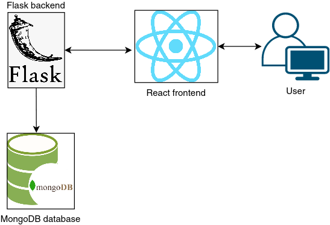

# Architecture

## General architecture
The program consists of a backend using Python's Flask library and a frontend made with React.
The backend uses a MongoDB database to store data. Backend and frontend are hosted on Heroku, MongoDB is hosted
at MongoDB Atlas. The project uses GitHub Actions for the CI.

## CI/CD and hosting
### Testing
Backend and frontend both have GitHub Actions workflows that run tests with each commit.
The test coverage report is also created at the same time and uploaded to the Codecov service.

### Deployment
The backend and frontend both have GitHub Actions workflows that build Docker images and pushes them to Heroku
automatically.

#### Backend
The backend image installs the dependencies using pip and then installs the Gunicorn server, which is used to run
the production version inside the container.

#### Frontend
The frontend image build is done in two stages. The first stage installs the dependencies using npm and builds the
React app. The second stage uses the nginx base image. Then it copies the production build made in the previous stage.
The frontend build then uses some bash trickery to get the correct PORT environment variable value assigned by Heroku.

## Database
Inventory reports, attachment files and user data are stored in the MongoDB database. To access the database in Python,
the PyMODM library is used.
